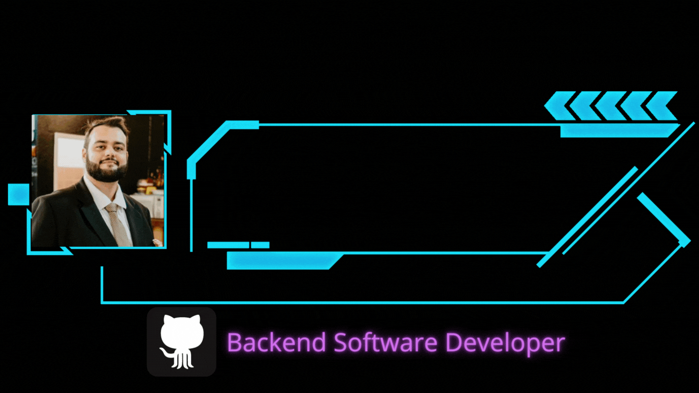
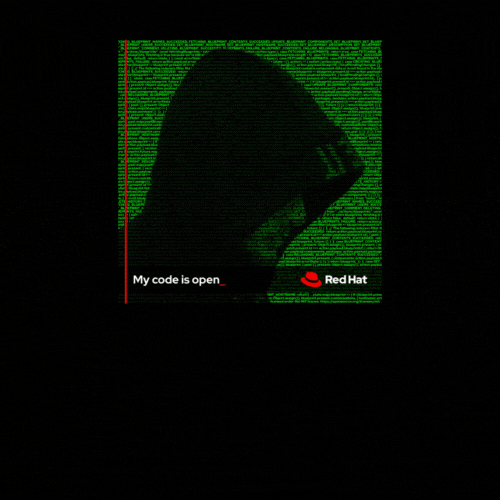
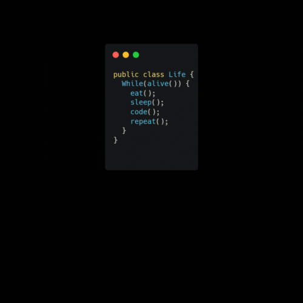

# Welcome to my tech world!
🕒 Joined Github 6 years ago

  

---

## About me 👨‍💻 

* Software Developer for almost 5 years.
* Software Engineering student at PUCRS University.
* Junior Backend Software Developer at [Digifred](https://digifred.com.br/).
* Looking to become a Senior Backend Developer.

---

## My Tech Knowledge

| Info                  | Techs                                                                                                                                                                                                                                                                                                                                                                                                                                                                                                                                                                                                                                                                                                                                                                                                                                                                                            |
|-----------------------|--------------------------------------------------------------------------------------------------------------------------------------------------------------------------------------------------------------------------------------------------------------------------------------------------------------------------------------------------------------------------------------------------------------------------------------------------------------------------------------------------------------------------------------------------------------------------------------------------------------------------------------------------------------------------------------------------------------------------------------------------------------------------------------------------------------------------------------------------------------------------------------------------|
 | Repository Managers   |                                                                                                                                                                                                                                                                                                                                                                                                                                                                                                                                                                                          |
| Programming Languages |          |
| Frameworks            |                                                                                                                                                                                                                                                                                                                                                                                                                                                                                                                                                                                                 | 
| Databases             |                                                                                                                                                                                                                                                                                                                                                                                         |
| Operational Systems   |                                                                                                                                                                                                                                                                                                                                                                                                                                                                                                                                                                                                                                                                                                    |
| CI/CD                 |     |                                                                                                                                                                                                                                                                                                                                                                                                                                                                                                                                                                                      
| Front-end|    |
---

## My organizations

* I use organizations to organize my repositories, on my Profile there are my personal projects, the organizations are for my studies, templates and other stuffs I've created.

|   ||||
|---|---|---|---|
|  || | |

