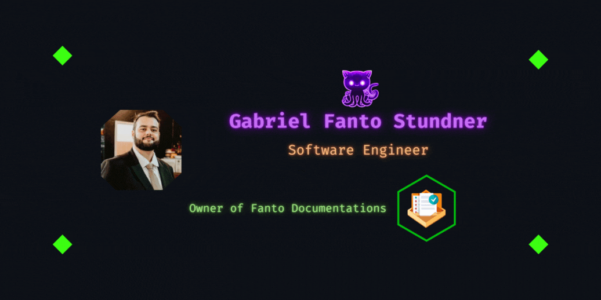
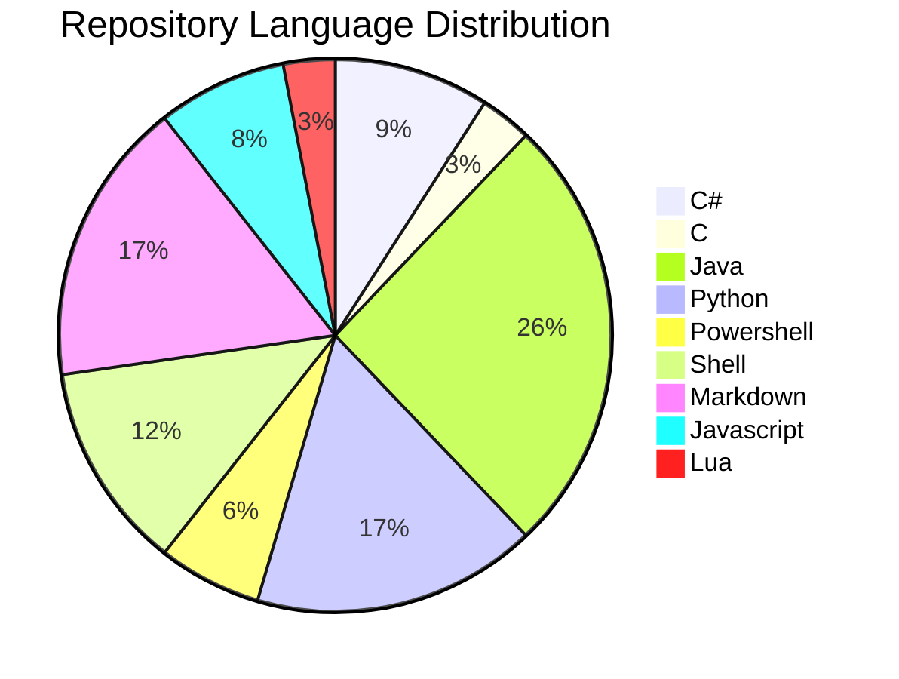
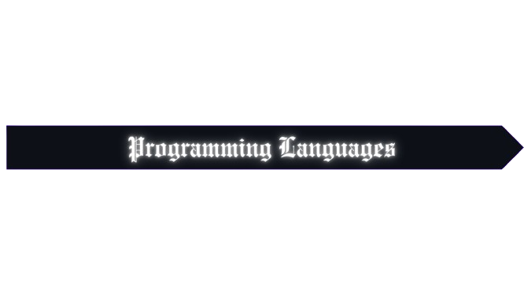

<table align="center"><tr><td align="center" width="9999">
    
</td></tr></table>

---

🕒 Joined Github 9 years ago

<table align="center"><tr><td align="center" width="9999">
    
</td></tr></table>

---

<table align="center"><tr><td align="center" width="9999">
    
</td></tr></table>
 
➡️ Software Developer for 7 years.

➡️ Graduated with a Bachelor's degree in Software Engineering from PUCRS.

➡️ My goal is to become a Senior Software Engineer.

➡️ Creating a better world with code!

➡️ CodeWars: 

---

<table align="center"><tr><td align="center" width="9999">
    
</td></tr></table>

---

<table align="center"><tr><td align="center" width="9999">
    
</td></tr></table>

  <table>
    <tr>
      <th></th>
      <th></th>
      <th></th>
      <th></th>
      <th></th>
    </tr>
    <tr>
      <td><a href="https://learn.microsoft.com/en-us/dotnet/csharp/">Documentation</a></td>
      <td><a href="https://www.tutorialspoint.com/java/index.htm">Documentation</a></td>
      <td><a href="https://www.python.org/">Documentation</a></td>
      <td><a href="https://devdocs.io/javascript/">Documentation</a></td>
      <td><a href="https://devdocs.io/typescript/">Documentation</a></td>
    </tr>
  </table>

  <table>
    <tr>
      <th></th>
      <th></th>
      <th></th>
      <th></th>
      <th></th>
    </tr>
    <tr>
      <td><a href="https://ruby-doc.org/3.2.2/">Documentation</a></td>
      <td><a href="https://kotlinlang.org/docs/home.html">Documentation</a></td>
      <td><a href="https://go.dev/doc/">Documentation</a></td>
      <td><a href="https://learn.microsoft.com/pt-br/cpp/c-language/?view=msvc-170">Documentation</a></td>
      <td><a href="https://dart.dev/guides">Documentation</a></td>
    </tr>
  </table>

  <table>
    <tr>
       <th></th>
       <th></th>
       <th></th>
    </tr>
    <tr>
      <td><a href="https://docs.github.com/en/get-started/writing-on-github/getting-started-with-writing-and-formatting-on-github/basic-writing-and-formatting-syntax">Documentation</a></td>
      <td><a href="https://www.overleaf.com/learn">Documentation</a></td>
      <td><a href="https://katex.org/docs/supported.html">Documentation</a></td>
    </tr>
  </table>

  <table>
    <tr>
      <th></th>
      <th></th>
    </tr>
    <tr>
      <td><a href="https://www.shellscript.sh/">Documentation</a></td>
      <td><a href="https://learn.microsoft.com/en-us/powershell/">Documentation</a></td>
    </tr>
  </table>

  <table>
    <tr>
      <th></th>
      <th></th>
      <th></th>
      <th></th>
    </tr>
    <tr>
      <td><a href="https://learn.microsoft.com/en-us/dotnet/">Documentation</a></td>
      <td><a href="https://docs.spring.io/spring-framework/reference/">Documentation</a></td>
      <td><a href="https://angular.io/docs">Documentation</a></td>
      <td><a href="https://docs.flutter.dev/">Documentation</a></td>
    </tr>
  </table>

  <table>
    <tr>
      <th></th>
      <th></th>
      <th></th>
      <th></th>
    </tr>
    <tr>
      <td><a href="https://dev.mysql.com/doc/">Documentation</a></td>
      <td><a href="https://www.postgresql.org/docs/">Documentation</a></td>
      <td><a href="https://www.mongodb.com/docs/">Documentation</a></td>
      <td><a href="https://firebase.google.com/docs/">Documentation</a></td>
    </tr>
  </table>

  <table>
    <tr>
      <th></th>
      <th></th>
    </tr>
    <tr>
      <td><a href="https://learn.microsoft.com/pt-br/windows/">Documentation</a></td>
      <td><a href="https://wiki.manjaro.org/index.php/Main_Page">Documentation</a></td>
    </tr>
  </table>

  <table>
    <tr>
      <th></th>
      <th></th>
    </tr>
    <tr>
      <td><a href="https://www.jenkins.io/doc/book/">Documentation</a></td>
      <td><a href="https://docs.github.com/en/actions">Documentation</a></td>
    </tr>
  </table>

  <table>
    <tr>
      <th></th>
      <th></th>
      <th></th>
      <th></th>
    </tr>
    <tr>
      <td><a href="https://www.w3schools.com/html/html_intro.asp">Documentation</a></td>
      <td><a href="https://www.w3schools.com/css/default.asp">Documentation</a></td>
      <td><a href="https://nodejs.org/en/docs">Documentation</a></td>
      <td><a href="https://react.dev/">Documentation</a></td>
    </tr>
  </table>

---

<table align="center"><tr><td align="center" width="9999">
    
</td></tr></table>

  <table>
    <tr>
      <th></th>
    </tr>
    <tr>
      <td><a align="center" href="https://youtu.be/YcW7CLAQJjQ">Open video on Youtube</a></td>
    </tr>
  </table>

