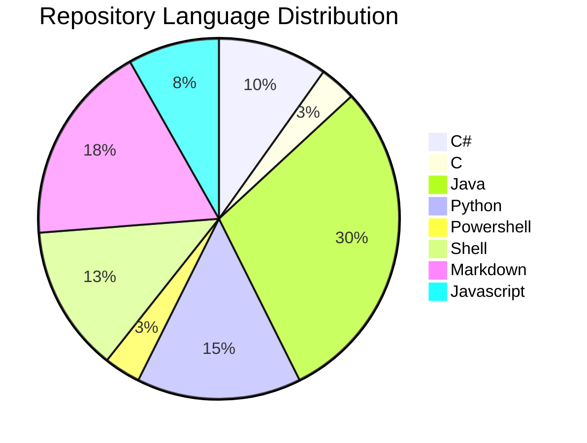

# $$\boxed{\color{orange} \frak{ Rise \space and \space Rise \space again \space until \space Lambs \space become \space Lions !} } $$

---

🕒 Joined Github 7 years ago

  

---

## $${\boxed{\color{#55AC4C} \mathbb{About} \space \mathbb{Me}}}$$ 
 
➡️ Software Developer for almost 6 years.

➡️ Software Engineering Student at PUCRS University.

➡️ My goal is to become a Senior Backend Software Developer.

➡️ Creating a better world with code!

---

## $${\boxed{\color{magenta} \sf Tech \space Mastery}}$$

### $$\sf Programming \space Languages$$

  <table>
    <tr>
      <th></th>
      <th></th>
      <th></th>
      <th></th>
      <th></th>
    </tr>
    <tr>
      <td><a href="https://learn.microsoft.com/en-us/dotnet/csharp/">Documentation</a></td>
      <td><a href="https://www.tutorialspoint.com/java/index.htm">Documentation</a></td>
      <td><a href="https://www.python.org/">Documentation</a></td>
      <td><a href="https://devdocs.io/javascript/">Documentation</a></td>
      <td><a href="https://devdocs.io/typescript/">Documentation</a></td>
    </tr>
  </table>

  <table>
    <tr>
      <th></th>
      <th></th>
      <th></th>
      <th></th>
      <th></th>
    </tr>
    <tr>
      <td><a href="https://ruby-doc.org/3.2.2/">Documentation</a></td>
      <td><a href="https://kotlinlang.org/docs/home.html">Documentation</a></td>
      <td><a href="https://go.dev/doc/">Documentation</a></td>
      <td><a href="https://learn.microsoft.com/pt-br/cpp/c-language/?view=msvc-170">Documentation</a></td>
      <td><a href="https://dart.dev/guides">Documentation</a></td>
    </tr>
  </table>

### $$\sf Markup \space Languages$$

  <table>
    <tr>
       <th></th>
       <th></th>
       <th></th>
    </tr>
    <tr>
      <td><a href="https://docs.github.com/en/get-started/writing-on-github/getting-started-with-writing-and-formatting-on-github/basic-writing-and-formatting-syntax">Documentation</a></td>
      <td><a href="https://www.overleaf.com/learn">Documentation</a></td>
      <td><a href="https://katex.org/docs/supported.html">Documentation</a></td>
    </tr>
  </table>

### $$\sf Scripting \space Languages$$

  <table>
    <tr>
      <th></th>
      <th></th>
    </tr>
    <tr>
      <td><a href="https://www.shellscript.sh/">Documentation</a></td>
      <td><a href="https://learn.microsoft.com/en-us/powershell/">Documentation</a></td>
    </tr>
  </table>

### $$\sf Frameworks$$

  
  
  
  
  

###

$$\sf Databases$$

###

  
  
  
  

###

$$\sf Operational Systems$$

###

  
  

###

$$\sf CI/CD$$

###

  
  
  

###

$$\sf Web development$$

###

  
  
  
  

---

## $$\boxed{\color{#7F7FFF} \mathbb{My} \space \mathbb{Technology} \space \mathbb{map}}$$

---

## $${\boxed{\color{#FD2654} \mathbb{My} \space \mathbb{Organizations}}}$$ 

* These Organizations below is where I keep my projects organized, in my main Profile I keep the Portfolio projects.

|   ||||
|---|---|---|---|
|  || | |

---

## $${\boxed{\color{#B19650} \mathbb{Latest} \space \mathbb{Video}}}$$ 

  
   
  <a href="https://youtu.be/YcW7CLAQJjQ">CLICK HERE</a>

