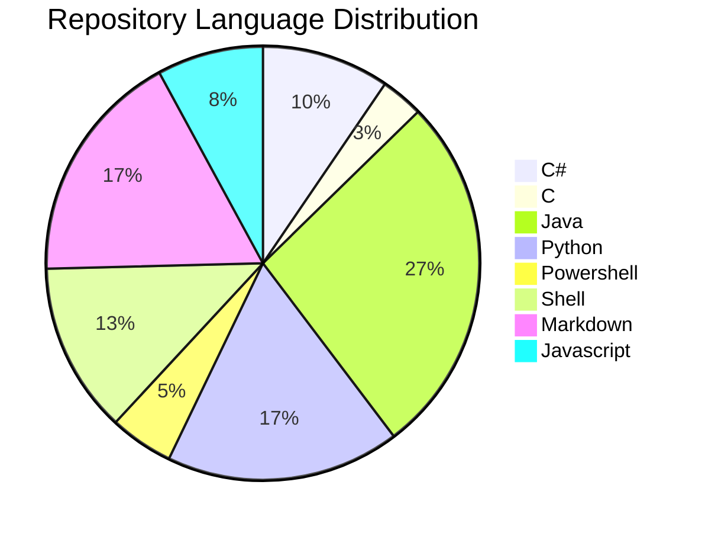

# $$\boxed{\color{orange} \frak{ Rise \space and \space Rise \space again \space until \space Lambs \space become \space Lions !} } $$

---

🕒 Joined Github 7 years ago

  

---

## $${\boxed{\color{#55AC4C} \sf{About} \space \sf{Me}}}$$ 
 
➡️ Software Developer for almost 6 years.

➡️ Graduated with a Bachelor's degree in Software Engineering from PUCRS.

➡️ My goal is to become a Senior Backend Software Developer.

➡️ Creating a better world with code!

---

## $$\boxed{\color{#7F7FFF} \sf{My} \space \sf{Technology} \space \sf{map}}$$

---

## $${\boxed{\color{magenta} \sf{Tech \space Mastery}}}$$

### $$\sf Programming \space Languages$$

  <table>
    <tr>
      <th></th>
      <th></th>
      <th></th>
      <th></th>
      <th></th>
    </tr>
    <tr>
      <td><a href="https://learn.microsoft.com/en-us/dotnet/csharp/">Documentation</a></td>
      <td><a href="https://www.tutorialspoint.com/java/index.htm">Documentation</a></td>
      <td><a href="https://www.python.org/">Documentation</a></td>
      <td><a href="https://devdocs.io/javascript/">Documentation</a></td>
      <td><a href="https://devdocs.io/typescript/">Documentation</a></td>
    </tr>
  </table>

  <table>
    <tr>
      <th></th>
      <th></th>
      <th></th>
      <th></th>
      <th></th>
    </tr>
    <tr>
      <td><a href="https://ruby-doc.org/3.2.2/">Documentation</a></td>
      <td><a href="https://kotlinlang.org/docs/home.html">Documentation</a></td>
      <td><a href="https://go.dev/doc/">Documentation</a></td>
      <td><a href="https://learn.microsoft.com/pt-br/cpp/c-language/?view=msvc-170">Documentation</a></td>
      <td><a href="https://dart.dev/guides">Documentation</a></td>
    </tr>
  </table>

### $$\sf Markup \space Languages$$

  <table>
    <tr>
       <th></th>
       <th></th>
       <th></th>
    </tr>
    <tr>
      <td><a href="https://docs.github.com/en/get-started/writing-on-github/getting-started-with-writing-and-formatting-on-github/basic-writing-and-formatting-syntax">Documentation</a></td>
      <td><a href="https://www.overleaf.com/learn">Documentation</a></td>
      <td><a href="https://katex.org/docs/supported.html">Documentation</a></td>
    </tr>
  </table>

### $$\sf Scripting \space Languages$$

  <table>
    <tr>
      <th></th>
      <th></th>
    </tr>
    <tr>
      <td><a href="https://www.shellscript.sh/">Documentation</a></td>
      <td><a href="https://learn.microsoft.com/en-us/powershell/">Documentation</a></td>
    </tr>
  </table>

### $$\sf Frameworks$$

  <table>
    <tr>
      <th></th>
      <th></th>
      <th></th>
      <th></th>
    </tr>
    <tr>
      <td><a href="https://learn.microsoft.com/en-us/dotnet/">Documentation</a></td>
      <td><a href="https://docs.spring.io/spring-framework/reference/">Documentation</a></td>
      <td><a href="https://angular.io/docs">Documentation</a></td>
      <td><a href="https://docs.flutter.dev/">Documentation</a></td>
    </tr>
  </table>

### $$\sf Databases$$

  <table>
    <tr>
      <th></th>
      <th></th>
      <th></th>
      <th></th>
    </tr>
    <tr>
      <td><a href="https://dev.mysql.com/doc/">Documentation</a></td>
      <td><a href="https://www.postgresql.org/docs/">Documentation</a></td>
      <td><a href="https://www.mongodb.com/docs/">Documentation</a></td>
      <td><a href="https://firebase.google.com/docs/">Documentation</a></td>
    </tr>
  </table>

### $$\sf Operational \space Systems$$

  <table>
    <tr>
      <th></th>
      <th></th>
    </tr>
    <tr>
      <td><a href="https://learn.microsoft.com/pt-br/windows/">Documentation</a></td>
      <td><a href="https://wiki.manjaro.org/index.php/Main_Page">Documentation</a></td>
    </tr>
  </table>

### $$\sf CI/CD$$

  <table>
    <tr>
      <th></th>
      <th></th>
    </tr>
    <tr>
      <td><a href="https://www.jenkins.io/doc/book/">Documentation</a></td>
      <td><a href="https://docs.github.com/en/actions">Documentation</a></td>
    </tr>
  </table>

### $$\sf Web \space development$$

  <table>
    <tr>
      <th></th>
      <th></th>
      <th></th>
      <th></th>
    </tr>
    <tr>
      <td><a href="https://www.w3schools.com/html/html_intro.asp">Documentation</a></td>
      <td><a href="https://www.w3schools.com/css/default.asp">Documentation</a></td>
      <td><a href="https://nodejs.org/en/docs">Documentation</a></td>
      <td><a href="https://react.dev/">Documentation</a></td>
    </tr>
  </table>

---

## $${\boxed{\color{#B19650} \sf{My} \space \sf{Latest} \space \sf{Video}}}$$

  <table>
    <tr>
      <th></th>
    </tr>
    <tr>
      <td><a align="center" href="https://youtu.be/YcW7CLAQJjQ">Open video on Youtube</a></td>
    </tr>
  </table>

