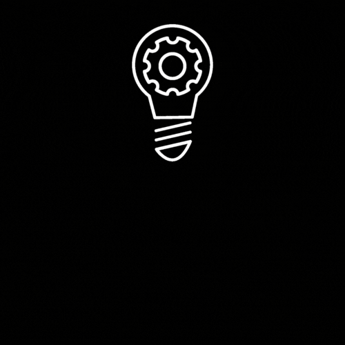

# $$\boxed{ \frak{ Rise \space and \space Rise \space again \space until \space Lambs \space become \space Lions !} } $$

---

🕒 Joined Github 6 years ago

  

---

## $${\boxed{\mathbb{About} \space \mathbb{Me}}}$$ 

* Software Developer for almost 5 years.
* Software Engineering Student at PUCRS University.
* My goal is to become a Senior Backend Software Developer.

---

---

## $${\boxed{\mathbb{My} \space \mathbb{Organizations}}}$$ 

* These Organizations below is where I keep my projects organized, in my main Profile I keep the Portfolio projects.

|   ||||
|---|---|---|---|
|  || | |

---

## $${\boxed{\mathbb{Latest} \space \mathbb{Video}}}$$ 

  
   
  <a href="https://youtu.be/YcW7CLAQJjQ">CLICK HERE</a>

